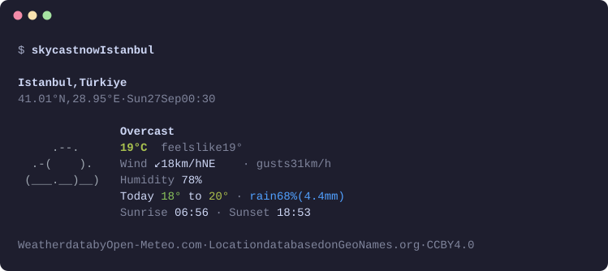
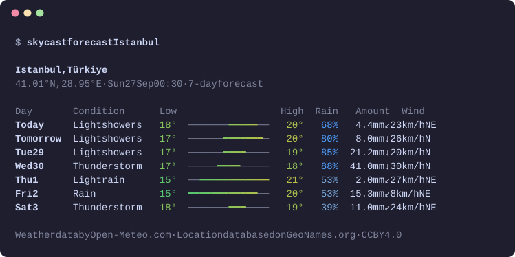
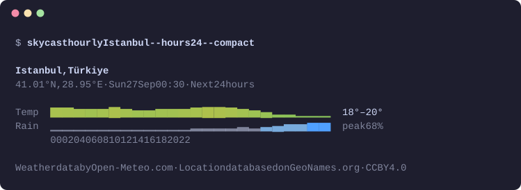
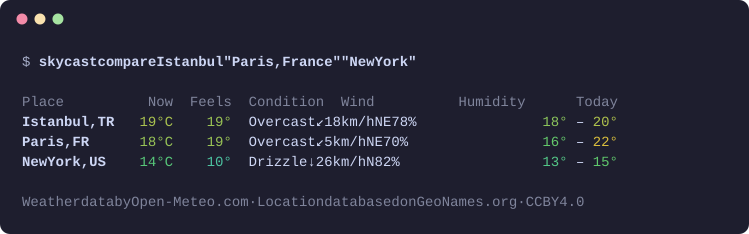
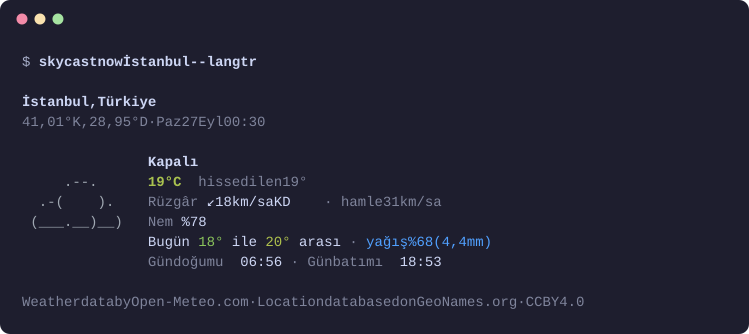

# skycast

Weather in your terminal: ASCII art, colour-coded temperatures, daily and
hourly forecasts, and side-by-side city comparisons. Any place on Earth, no
API key.

[](https://github.com/mylcin/weather-cli/actions/workflows/ci.yml)
[](https://www.npmjs.com/package/skycast)
[](https://nodejs.org)
[](LICENSE)

<p align="center">
  
</p>

## Features

- **Any place on Earth.** Cities, towns and villages in any language, with
  "City, Country" or "City, Region" to be precise. When a name is ambiguous
  (Paris, London, Springfield) you pick from a list.
- **Now, daily and hourly.** An ASCII picture of the sky, temperatures on a
  colour scale, wind arrows, UV, sunrise and sunset. Up to 16 days and 168
  hours, with range bars and sparklines.
- **Compare places.** One row per place, all fetched in a single request.
- **Made for terminals and scripts.** Adapts to narrow windows, turns colour
  off for pipes and `NO_COLOR`, prints versioned JSON with `--json`, returns
  meaningful exit codes, and completes in bash, zsh and fish.
- **Remembers you.** A default place, favourites, units and language. Plain
  `skycast` shows your places.
- **Keeps working offline, briefly.** Answers are cached for 10 minutes and
  shown with a notice for up to a day when the network is down.
- **English and Turkish.** Everything, from weather descriptions to error
  messages and help.

## Install

```sh
npm install --global skycast
```

Or try it without installing:

```sh
npx skycast Istanbul
```

skycast needs Node.js 20.19 or later.

## Usage

### Current weather

```sh
skycast now Istanbul
skycast Istanbul                # the same: a place on its own means "now"
skycast now "Paris, France"
skycast now --lat 41.01 --lon 28.95
```

### Daily forecast

```sh
skycast forecast Istanbul --days 7
```



### Hourly forecast

```sh
skycast hourly Istanbul --hours 24
skycast hourly Istanbul --compact   # the charts without the table
```



### Compare places

```sh
skycast compare Istanbul "Paris, France" "New York"
```



### In Turkish

```sh
skycast now İstanbul --lang tr
```



### Commands

| Command                                               | What it does                                                      |
| ----------------------------------------------------- | ----------------------------------------------------------------- |
| `skycast [place]`                                     | Current weather; with no place, your default place and favourites |
| `skycast now [place]`                                 | Current conditions with an ASCII picture                          |
| `skycast forecast [place] --days <1-16>`              | Daily forecast, 7 days by default                                 |
| `skycast hourly [place] --hours <1-168>`              | Hourly forecast with sparklines, 24 hours by default              |
| `skycast compare <place> <place>…`                    | Up to 10 places side by side                                      |
| `skycast config [list\|get\|set\|unset\|reset\|path]` | Default place, units and language                                 |
| `skycast fav [add\|remove\|list]`                     | Favourite places                                                  |
| `skycast cache [clear\|path]`                         | Cached answers                                                    |
| `skycast completion <bash\|zsh\|fish>`                | Shell completion script                                           |

Every command has `--help` with examples.

### Places

- Add the country or region after a comma: `"Paris, France"`,
  `"Springfield, Illinois"`, `"Perth, UK"`. Country codes work too.
- Or narrow the search with `--country TR`, or skip it with `--lat` and
  `--lon`.
- An ambiguous name opens a picker when you are at a terminal. In scripts
  and pipes skycast takes the most likely place and says so on stderr.
- A country on its own means its capital when the capital shares the name
  (Mexico, Panama, Kuwait).

### Global options

| Option                           | Effect                                                      |
| -------------------------------- | ----------------------------------------------------------- |
| `-u, --units <metric\|imperial>` | Unit system                                                 |
| `-l, --lang <en\|tr>`            | Language                                                    |
| `--json`                         | JSON on stdout, for scripts                                 |
| `-c, --compact`                  | Shorter output: one line per place, tables without headings |
| `--no-color`                     | No colour; `NO_COLOR=1` does the same                       |
| `--ascii`                        | ASCII only, for terminals without Unicode                   |
| `--no-cache`                     | Always fetch fresh data                                     |
| `--verbose`                      | Requests, timings and cache hits on stderr                  |

## Settings

```sh
skycast config set city Istanbul
skycast config set units imperial
skycast config set lang tr
skycast fav add "Paris, France"
skycast fav add Tokyo

skycast            # your default place in full, then favourites side by side
skycast config     # what is set, and what is automatic
```

A setting is picked in this order: the flag, then an environment variable,
then the saved value, then an automatic default. Language follows your
system locale. Imperial units are the default only when both the locale
and the time zone are American, because many people elsewhere keep an
`en_US` locale.

| Where        | Settings                        | Cache                          |
| ------------ | ------------------------------- | ------------------------------ |
| Linux, macOS | `~/.config/skycast/config.json` | `~/.cache/skycast`             |
| Windows      | `%APPDATA%\skycast\config.json` | `%LOCALAPPDATA%\skycast\cache` |
| `XDG_*` set  | `$XDG_CONFIG_HOME/skycast`      | `$XDG_CACHE_HOME/skycast`      |

| Variable                                        | Effect                                            |
| ----------------------------------------------- | ------------------------------------------------- |
| `SKYCAST_LANG`, `SKYCAST_UNITS`                 | Language and units, below the flags               |
| `SKYCAST_CONFIG_DIR`, `SKYCAST_CACHE_DIR`       | Where settings and cache live                     |
| `SKYCAST_FORECAST_URL`, `SKYCAST_GEOCODING_URL` | Another Open-Meteo server, e.g. a self-hosted one |
| `NO_COLOR`, `FORCE_COLOR`                       | Turn colour off, or force it on for pipes         |
| `COLUMNS`                                       | Layout width                                      |

## Scripting

### JSON

`--json` prints one JSON document on stdout and nothing else. `now`,
`forecast` and `hourly` print a report with `location`, `units`, `current`,
`daily`, `hourly`, `meta` and `attribution`.

<details>
<summary>Full output of <code>skycast now Istanbul --json</code></summary>

```json
{
  "schemaVersion": 1,
  "location": {
    "name": "Istanbul",
    "region": "Istanbul",
    "country": "Republic of Türkiye",
    "countryCode": "TR",
    "latitude": 41.01384,
    "longitude": 28.94966,
    "timezone": "Europe/Istanbul"
  },
  "units": {
    "system": "metric",
    "temperature": "°C",
    "speed": "km/h",
    "precipitation": "mm",
    "pressure": "hPa"
  },
  "current": {
    "time": "2026-09-27T00:30",
    "temperature": 19.4,
    "feelsLike": 18.6,
    "humidity": 78,
    "windSpeed": 17.7,
    "windGusts": 31.3,
    "windDirection": 39,
    "weatherCode": 3,
    "condition": "cloudy",
    "description": "Overcast",
    "isDay": false,
    "uvIndex": 0,
    "precipitation": 0,
    "pressure": 1018.4,
    "cloudCover": 100
  },
  "daily": [
    {
      "date": "2026-09-27",
      "weatherCode": 80,
      "condition": "rain",
      "description": "Light showers",
      "temperatureMin": 17.7,
      "temperatureMax": 19.7,
      "precipitationSum": 4.4,
      "precipitationProbability": 68,
      "windSpeedMax": 22.7,
      "windDirection": 27,
      "uvIndexMax": 3.45,
      "sunrise": "2026-09-27T06:56",
      "sunset": "2026-09-27T18:53"
    }
  ],
  "hourly": [],
  "meta": {
    "fetchedAt": "2026-09-26T21:30:00.000Z",
    "cached": false,
    "stale": false
  },
  "attribution": [
    {
      "text": "Weather data by Open-Meteo.com",
      "url": "https://open-meteo.com/",
      "license": "CC BY 4.0"
    },
    {
      "text": "Location data based on GeoNames.org",
      "url": "https://www.geonames.org/",
      "license": "CC BY 4.0"
    }
  ]
}
```

</details>

- Numbers are in the units named in `units`.
- Times are the place's local time, without an offset.
- `weatherCode` is the WMO code, `condition` a stable group
  (`clear`, `rain`, `thunderstorm`…), and `description` is in `--lang`.
- `compare` prints `results`, one per place: `ok: true` with a `report`, or
  `ok: false` with an `error`. Plain `skycast` prints `city` and `favorites`.
- `config` and `fav list` print the saved settings and places.
- `schemaVersion` changes only for breaking changes. New fields may appear.

```sh
skycast now Istanbul --json | jq '.current.temperature'
```

### Exit codes

| Code | Meaning                                              |
| ---- | ---------------------------------------------------- |
| 0    | Success, including cached data shown while offline   |
| 1    | Unexpected error, or an invalid settings file        |
| 2    | Invalid command, option or value                     |
| 3    | Place not found                                      |
| 4    | Network unreachable or timed out, and nothing cached |
| 5    | The weather service returned an error                |
| 130  | Cancelled with Ctrl+C                                |

With `--json`, errors are one JSON line on stderr:
`{"error":{"code":"LOCATION_NOT_FOUND","message":"…","exitCode":3}}`.

## Shell completion

```sh
# bash: in ~/.bashrc
eval "$(skycast completion bash)"

# zsh: in ~/.zshrc, or save it on your $fpath
source <(skycast completion zsh)

# fish
skycast completion fish > ~/.config/fish/completions/skycast.fish
```

The scripts are generated from the command tree and complete commands,
options and their values. Nothing runs on each TAB, and the bash script
works with the bash 3.2 that macOS ships.

## How it works

```text
src/
├── cli/         commander program, commands, prompts, completion
├── renderers/   text, tables, sparklines, ASCII art, JSON (pure functions)
├── core/        models, units, place matching, weather and location services
├── providers/   WeatherProvider and GeocodingProvider, and Open-Meteo
├── infra/       HTTP client, response cache, settings store, paths
└── i18n/        English and Turkish dictionaries
```

A command runs in this order:

1. The CLI parses the arguments. A session then settles the language,
   units, terminal width, colour depth and Unicode support.
2. The location service geocodes the place and ranks the matches, asking
   only when the choice is real.
3. The weather service sends one provider request for every place, and
   converts units.
4. A renderer turns the report into text or JSON.

The dependency rules are ESLint rules (`no-restricted-imports`):

- `core` knows nothing about the CLI, HTTP or Open-Meteo.
- `renderers` never fetch.
- `providers` never render.

Services are built with plain factory functions and receive their
dependencies as arguments, so tests pass in fakes and a new data source
means two interfaces, wired in [`src/cli/container.ts`](src/cli/container.ts).

Some details are not obvious from the code layout:

- **Place matching.** A namesake only triggers the picker when its
  population is at least 1% of the best match's. That means "Paris" asks
  about Texas, while "Eskişehir" does not ask about a village of 82 people.
  Names are compared without case or accents, with extra folding for
  letters like ł, ß and ı.
- **Time.** API times are wall-clock strings at the place and are never
  parsed with `new Date()`. Output is the same in every time zone.
- **Resilience.** Each attempt has its own timeout, and connection failures
  are retried with jittered back-off. Short `Retry-After` delays are
  honoured, long ones fail fast. When the service is unreachable, cached
  data up to a day old is shown with a notice.
- **Output.** Tables measure plain text, drop low-priority columns on
  narrow terminals and add colour last, so escape codes never shift
  columns. Colour comes from `NO_COLOR`, `FORCE_COLOR`, the TTY and the
  terminal's colour depth. Truecolor is downgraded to 256 or 16 colours.

## Tech stack

| Concern                  | Choice                                                                         | Why                                                                                                 |
| ------------------------ | ------------------------------------------------------------------------------ | --------------------------------------------------------------------------------------------------- |
| Language, runtime        | TypeScript (strict), Node.js 20.19+                                            | Typed end to end with no `any`; built-in `fetch` and `Intl`                                         |
| CLI                      | [commander](https://github.com/tj/commander.js) 14 + extra-typings             | The most used Node CLI framework: typed options, subcommands, no dependencies. v15 needs Node 22    |
| Prompt                   | [@inquirer/select](https://github.com/SBoudrias/Inquirer.js)                   | Cancels cleanly on Ctrl+C or a closed stdin; draws on stderr so stdout stays clean                  |
| Colour                   | [ansis](https://github.com/webdiscus/ansis)                                    | Truecolor for the temperature scale with automatic 256/16-colour fallback; picocolors has 16 only   |
| Width and wrapping       | fast-string-width, fast-wrap-ansi                                              | Same results as string-width and wrap-ansi without their import cost at startup                     |
| Spinner                  | [yocto-spinner](https://github.com/sindresorhus/yocto-spinner)                 | Tiny; loaded only when a request is slow and stderr is a terminal                                   |
| Validation               | [zod](https://zod.dev) 4                                                       | API answers and the settings file are validated before they are used                                |
| HTTP                     | built-in `fetch`                                                               | Timeouts, retries and caching fit in one small module that msw can test as is                       |
| Tables, pictures, charts | own code                                                                       | Dropping columns on narrow terminals and stable snapshots; boxen and cli-table3 can't drop columns  |
| Settings, cache          | own code on `node:fs`                                                          | XDG paths on every OS and atomic writes; `conf` ignores XDG on macOS                                |
| Build                    | [tsdown](https://tsdown.dev)                                                   | The successor tsup points to; one bundle, so the package has no runtime dependencies                |
| Tests                    | [Vitest](https://vitest.dev) 4, [msw](https://mswjs.io) 2                      | Native TypeScript and ESM; msw intercepts the real `fetch`. v4 is the last major supporting Node 20 |
| Lint, format             | ESLint 10 + typescript-eslint (strict, type-aware), Prettier                   | Type-aware rules, and import rules that keep the layers apart                                       |
| Git hooks, commits       | [lefthook](https://github.com/evilmartians/lefthook), commitlint               | One small binary for all hooks; Conventional Commits                                                |
| Releases                 | [Changesets](https://github.com/changesets/changesets), npm trusted publishing | A changelog built from pull requests, and no npm token stored in the repository                     |

The published package is a single bundled file. The libraries above are
compiled into it, and their licences ship alongside in
`dist/THIRD_PARTY_LICENSES.md`.

## Development

```sh
git clone https://github.com/mylcin/weather-cli.git
cd weather-cli
nvm use               # Node 22.18+ for the dev tools; the CLI itself runs on 20.19+
npm install           # also installs the git hooks
npm run dev -- now Istanbul
npm run check         # lint, types, formatting and tests
```

See [CONTRIBUTING.md](CONTRIBUTING.md) for the project layout, tests,
screenshots and the demo recording, and releases.

## Data and attribution

Weather data comes from [Open-Meteo](https://open-meteo.com/) and place
names from [GeoNames](https://www.geonames.org/), both under
[CC BY 4.0](https://creativecommons.org/licenses/by/4.0/). skycast credits
them under every result, and in the `attribution` field of JSON output.
`--compact`, meant for status bars, leaves the credit line out.

The Open-Meteo API is free for non-commercial use, within fair limits of
fewer than 10,000 requests a day. skycast caches answers, and `compare`
asks for all places in one request, so everyday use stays far below that.
You can also [run your own Open-Meteo server](https://github.com/open-meteo/open-meteo)
and point skycast at it with `SKYCAST_FORECAST_URL` and
`SKYCAST_GEOCODING_URL`.

## License

[MIT](LICENSE) © 2026 Mustafa Yalçın
